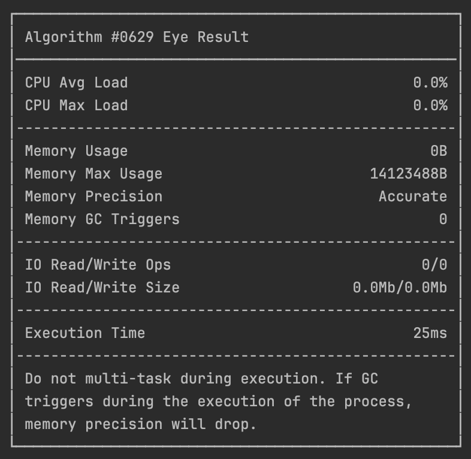

# AlgoEye
[](https://jitpack.io/#janbarari/AlgoEye)

AlgoEye seamlessly measures memory usage, CPU usage, IO usage, execution time, and provides memory leak information for your Kotlin/Java algorithms and code blocks.

What's the point of using it
-----
Struggling with slow apps and mysterious memory, disk(IO), CPU problems? AlgoEye is your new best friend! It easily checks your code.

Think of it this time you spent writing beautiful code, but it runs slow. AlgoEye shows you why, like spotting memory spikes or long-running operations. Its simple interface helps you fix these issues quickly.

This means faster development, cleaner code, and happier users! AlgoEye gives you the data you need to make smart choices, optimize your app, and make it run like a champ.

Ditch the guessing, embrace the power, and unlock your expertise with AlgoEye!

Installation
------------
```gradle
repositories {
    maven { url 'https://jitpack.io' }
}

implementation 'com.github.janbarari:AlgoEye:0.1-beta11'
```

Usage
-----
```kotlin
algoEye(title = "Algorithm #0629") {
    // put your codes here
}.prettyPrint(
    memoryFormatter = MemoryFormatters.mb,
    timeFormatter = TimeFormatters.millis
)
```
Output
-----



Unit Tests
------
```kotlin
assertDoesNotThrow<AlgoEyeExceedMemoryException> {
    assertAlgoEye("My Test 1", memoryThresholdInByte = 1000, timeThresholdInMs = 1000) {
        // Fails when memory usage exceeds the threshold
    }
}

assertDoesNotThrow<AlgoEyeExceedExecutionException> {
    assertAlgoEye("My Test 2", memoryThresholdInByte = 1000, timeThresholdInMs = 1000) {
        // Fails when execution took longer than threshold
    }
}

assertDoesNotThrow<AlgoEyeRanOutOfMemoryException> {
    assertAlgoEye("My Test 3", memoryThresholdInByte = 1000, timeThresholdInMs = 1000) {
        // Fail when process ran out of memory
    }
}
```

License
-------
Copyright (C) 2024 Mehdi Janbarari (@janbarari)

AlgoEye binaries and source code can be used according to the [MIT License](LICENSE).
